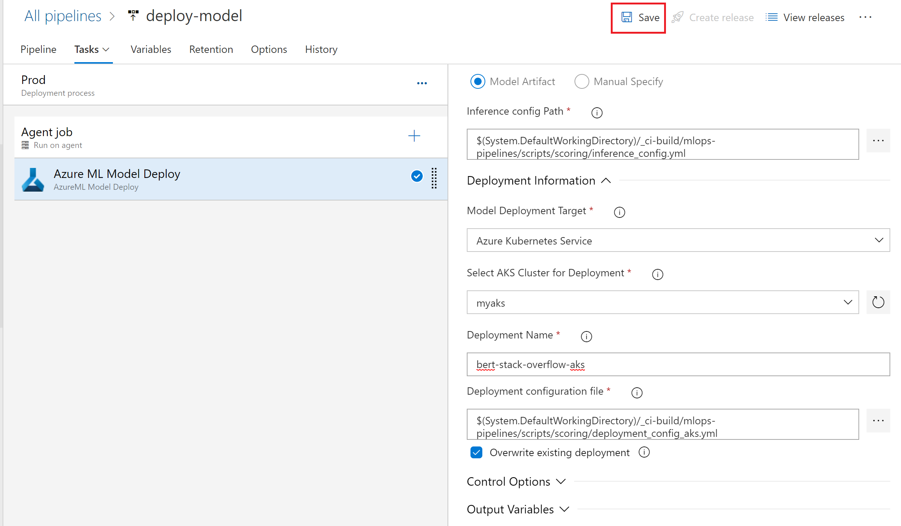
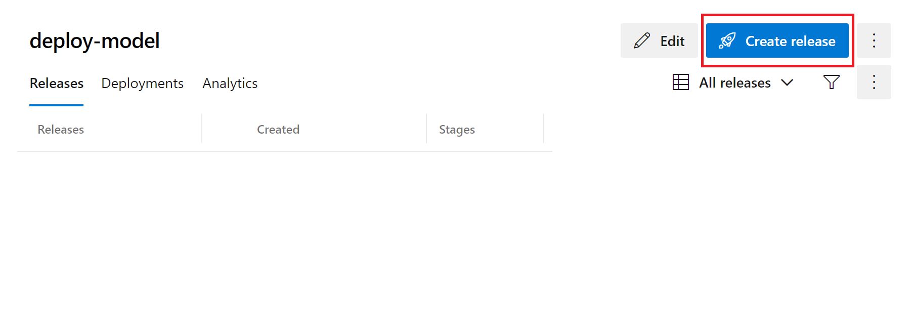

# TensorFlow 2.0 with Azure MLOps

| Pipeline step | Status badge|
| ------------- | ------------|
|Resource creation | [](https://dev.azure.com/gopalv0408/status-badge/_build/latest?definitionId=19&branchName=master) |
| Build | [](https://dev.azure.com/gopalv0408/status-badge/_build/latest?definitionId=20&branchName=master) |

## Overview

For this exercise, we assume that you have trained and deployed a machine learning model and that you are now ready to manage the end-to-end lifecycle of your model. [MLOps](https://docs.microsoft.com/azure/machine-learning/service/concept-model-management-and-deployment) can help you to automatically deploy your model as a web application while implementing quality benchmarks, strict version control, model monitoring, and providing an audit trail.

## Prerequisites

While they are not required to complete this exercise, the notebooks on [training](aka.ms/tfworld_training) and [inferencing](aka.ms/tfworld_inferencing) that are included in this repo provide useful context for this exercise.

Additionally, this tutorial assumes you have sufficient quota allocated in the **southcentralus** region to deploy a **Standard_NC6s_V3** and two **DSv2** nodes.

## Getting Started with this Repo

### 1. Get the source code

Log in to your [Github](https://github.com/) account, or [create](https://github.com/join) one if you do not have an account. Fork this project, by clicking the "Fork" button in the top right of the Github screen.

### 2. Set up an Azure DevOps project

We use Azure DevOps to automatically create new models according to certain triggers (like if you update the code in your Github repository). 

#### Create your Azure DevOps account

[Sign into your DevOps account here](https://aex.dev.azure.com/me), or [sign up for Azure DevOps](https://azure.microsoft.com/services/devops/).

#### Create an Azure DevOps organization

Now, you need to create a new organization. Each organization can contain multiple projects, so you want to create an organization that could sensibly contain multiple related projects. Because organization names must be unique, let's leave the default organization name as is. Let the default region selection of "Central US" be unchanged. Now select "Continue."


#### Create a new project

You should be automatically redirected to a screen to create a new project. Name your project "azure-bert-so" and then click "Create." Give it some description, like "Automated StackOverflow question-tagging with TensorFlow 2.0 and BERT," leave it Private, and then click "Create project."


> Note: if you ever need to create a new project in the future, click "Azure DevOps" in the top left of the DevOps window, and then "New project" in the top right of the window.

> Note: The next few steps take place in the [Azure portal](portal.azure.com), which is a **different website** from Azure DevOps.

### 3. Create a Service Principal to log in to Azure

> Note: if you are participating in the TensorFlow World workshop on October 28 and 29, 2019, you should have had a service principal created on your behalf. Check the email you received after signing up for the lab for these details.

#### Open Azure Active Directory

You have now set up an Azure DevOps organization that will contain the project consisting of your StackOverflow question-tagging BERT model. Exciting! In order to access your Azure account to create resources on your behalf, Azure DevOps uses a [service principal](https://docs.microsoft.com/en-us/azure/active-directory/develop/app-objects-and-service-principals) to authenticate into the Azure Portal. To create a service principal, log into the [Azure portal](portal.azure.com) (**NOTE: The Azure portal is NOT the same as Azure DevOps**), click the menu icon in the top left to show the sidebar menu, and click "Azure Active Directory" on the left side of the screen.


#### Create a Service Principal

Then, in the menu on the left-hand side, select "App registrations." Then select "New registration" at the top left of your screen. Name your app "tfworld_workshop" and then click "Register." You should be redirected to a screen showing the app you just created. 


#### Create and take note of your secret

Click "Certificates & secrets" on the left-hand side, then "New client secret." Give the secret a descriptive name, like "tensorflow_secret," then click Add. 


**Make sure to take note of the secret ID now, as you will not be able to see it again**.

#### Take note of the app and tenant ID

Then click on the "Overview" page on the left side and take note of the "Application (client) ID" and the "Directory (tenant) ID".


### 4. Give your service principal access to your subscription

> Note: If you are a TensorFlow World workshop participant, you can skip this step.

You now have the information you need to log into your service principal, but your service principal itself doesn't have access to your Azure subscription. Let's fix that.

Type in the name of your subscription in the search bar on the Azure Portal. Open your subscription, and go to "Access control (IAM)" on the left-hand side.  Click "Add"->"Add role assignment" on the top left. Select the "Contributor" role, then type in the name of the service principal you just created in order to grant it access.


> Note: The next step requires you to return to [Azure DevOps](https://aex.dev.azure.com/me). Click on the name of the project you just created in order to open it up.

### 5. Create an Azure DevOps variable group

We make use of variable group inside Azure DevOps to store variables that we want to make available across multiple pipelines. To create a variable group, open Azure DevOps, then click "Pipelines"->"Library" on the left-hand side.


 In the menu near the top of the screen, click "+ Variable group." Name your variable group **``devopsforai-aml-vg``** as this value is hard-coded within our [build yaml file](../yml/publish-training-pipeline.yml).


The variable group should contain the following variables:

| Variable Name               | Value              |
| --------------------------- | ---------------------------- |
| BASE_NAME                   | **If you are a TFworld workshop participant, fill in your participant ID (6 digit number following your resource group name)** [otherwise, use some name with fewer than 10 lowercase letters]                        |
| TENANT_ID                   | Fill in the value of "Directory (tenant) ID" from service principal creation                            |
| SUBSCRIPTION_ID             | Fill in your Azure subscription ID, found on the "Overview" page of your subscription in the Azure portal                            |
| LOCATION                    | southcentralus                  |
| SP_APP_ID                   | Fill in "Application (client) ID" from service principal creation |
| SP_APP_SECRET               | Fill in the secret from service principal creation |

Mark **SP_APP_SECRET** variable as a secret one.

Make sure to select the **Allow access to all pipelines** checkbox in the variable group configuration.

### 6. Create an Azure Resource Manager service connection

In order to access your Azure subscription, you need an Azure Resource Manager connection in Azure DevOps.

Access the window below by clicking on "Project settings" (the gear icon in the bottom left of the Azure DevOps window).


Click on "Service connections." Under "New service connection" (top left), choose "Azure Resource Manager." Set "Scope level" to "Subscription" and choose your subscription.

Give the connection name **``AzureResourceConnection``** as this value is hard-coded in the pipeline definition. 

If you are a TFWorld Workshop participant, fill in the **``Resource Group``** field with the name of the Resource Group you are using, because you do not Subscription-level permissions.


### 7. Create resources

> Note: If you are a TF World workshop participant, you can skip this step, as your resources were created for you.

The easiest way to create all required resources is to leverage our existing [Infrastructure as Code (IaC) pipeline](create-resources/iac-create-environment.yml). This IaC pipeline creates the resources specified in an [Azure Resource Manager (ARM) template](create-resources/arm-templates/cloud-environment.json).

Click on "Pipelines" -> "Build" on the left-hand side, then "New pipeline" to create a build pipeline, which will use the ARM template to create Azure resources.


Refer to an **Existing Azure Pipelines YAML file**, then choose the one corresponding to **iac-create-environment.yml**.

Having done that, run the pipeline.

Check out created resources in the [Azure Portal](portal.azure.com):


### 8. Set up a build pipeline

Let's review what we have so far. We have created a Machine learning workspace in Azure and some other things that go with it (a datastore, a keyvault, and a container registry). Ultimately, we want to have a deployed model that we can run queries against. So now that we have this workspace, let's use it to create a model!

#### Pipeline overview

First, [open](./yml/publish-training-pipeline.yml) up the build .yml file in GitHub. 

The YAML file includes the following steps:

1. It [configures triggers](https://docs.microsoft.com/azure/devops/pipelines/yaml-schema?view=azure-devops&tabs=schema#pr-trigger) that specify which events (such as GitHub pull requests) should cause the model to be rebuilt. 
1. It specifies a the type of VM image from which to create a [pool](https://docs.microsoft.com/azure/devops/pipelines/yaml-schema?view=azure-devops&tabs=schema#pool) for running the training pipeline.
1. It specified [steps](https://docs.microsoft.com/azure/devops/pipelines/yaml-schema?view=azure-devops&tabs=schema#steps) to run, by importing the contents of a different YAML file.
1. It specified some [tasks](https://docs.microsoft.com/azure/devops/pipelines/yaml-schema?view=azure-devops&tabs=schema#task), including [invoking bash](https://docs.microsoft.com/azure/devops/pipelines/yaml-schema?view=azure-devops&tabs=schema#bash) to run a Python script, [copying files](https://docs.microsoft.com/azure/devops/pipelines/tasks/utility/copy-files?view=azure-devops&tabs=yaml), and [publishing a build artifact](https://docs.microsoft.com/azure/devops/pipelines/tasks/utility/publish-build-artifacts?view=azure-devops).

#### Running your pipeline

Now that you understand the steps in your pipeline, let's see what it actually does!

In your [Azure DevOps](https://dev.azure.com) project, use the left-hand menu to navigate to "Pipelines"->"Build." Select "New pipeline," and then select "GitHub." If you are already authenticated into GitHub, you should see the repository you forked earlier. Select "Existing Azure Pipelines YAML File." In the pop-up blade, select the correct branch of your GitHub repo and select the path referring to [publish-training-pipeline.yml](./yml/publish-training-pipeline.yml) in your forked **GitHub** repository.

You will now be redirected to a review page. Check to make sure you still understand what this pipeline is doing. If everything looks good, click "Run."

While that's running, let's rename your pipeline to something more descriptive. Go to "Pipelines" -> "Builds," click on the three vertical dots on the top right-hand side, and select "Rename/move." Change the name to **ci-build**.

Once the pipeline is finished, explore the execution logs by clicking on the name of the pipeline under "Pipelines" -> "Builds."

Great, you now have the build pipeline setup, you can either manually trigger it whenever you like or let it be automatically triggered every time there is a change in the master branch.

### 9. Install the Azure ML marketplace extension

The pipeline you will build in the next step leverages the **Azure Machine Learning** extension to deploy your model. Go ahead and follow the [instructions](https://marketplace.visualstudio.com/items?itemName=ms-air-aiagility.vss-services-azureml) to install this extension in your DevOps organization.

### 10. Create Azure ML service connection

Even though we created a service connection earlier in order to create resources, we need a different service connection to your workspace in order to access the trained model. To create this new service connection, go to the project settings (by clicking on the gear icon at the bottom left of the screen), and then click on **Service connections** under the **Pipelines** section:

 > Note: Creating service connection using Azure Machine Learning extension requires your user to have 'Owner' or 'User Access Administrator' permissions on the Workspace.


### 11. Create the release pipeline.

The final step is to deploy your model with a release pipeline.

Go to "Pipelines" -> "Releases." In the top right of the second navigation bar from the left, select "New" -> "New release pipeline." Select "Empty job" under "Select a template" on the blade that pops up. 


Call this stage "Prod," by editing the value of "Stage name" in the blade on the right hand side. 


### 12. Add artifacts to your pipeline

In order for this Release pipeline to work, it needs access to the trained model we produced in the build pipeline. The release pipeline accesses the trained model as part of something called an Artifact. To give this release pipeline access to the relevant artifacts, click on "Add an artifact" in the "Artifacts" box.


Next, select "AzureML Model Artifact" (you may need to click "Show more"). Select the correct service endpoint (you should have created this in the previous step) and model name. Leave the other settings as they are, and click "Add."

Let's also give the release pipeline access to the build artifact, which contains some of the files that the release pipeline needs in order to run. Click on "Add" in the "Artifacts" box, select "Build," and ensure that the source alias is set to "_ci-build". This naming is necessary for the next step to work properly.

### 13. Add QA stage

Great, so your release pipeline has access to your artifacts, but it doesn't actually _do_ anything. Let's give it some work. First, let's have it deploy to a quality assurance (QA) instance hosted with Azure Container Instances (ACI).

Click on the hyperlinked text that says "1 job, 0 task" in the name of the stage.

Click on the plus icon on the right hand side of the cell which says "Agent job." On the menu which appears, search for "Azure ML Model Deploy," and click "Add."

 Click on the red text which says "Some settings need attention" and fill in the values shown in the table below:

| Parameter                         | Value                                                                                                |
| --------------------------------- | ---------------------------------------------------------------------------------------------------- |
| Display Name                      | Azure ML Model Deploy                                                                                |
| Azure ML Workspace                | Fill in the name of your Azure ML service connection                                                               |
| Inference config Path             | `$(System.DefaultWorkingDirectory)/_ci-build/mlops-pipelines/scripts/scoring/inference_config.yml`      |
| Model Deployment Target           | Azure Container Instance                                                                             |
| Deployment Name                   | bert-stack-overflow-aci                                                                              |
| Deployment Configuration file     | `$(System.DefaultWorkingDirectory)/_ci-build/mlops-pipelines/scripts/scoring/deployment_config_aci.yml` |
| Overwrite existing deployment     | X                                                                                                    |

Then click "Save."

### 14. Add Prod Stage

Under the box corresponding to the QA stage, click Prod.

Click on the plus icon on the right hand side of the cell which says "Agent job." On the menu which appears, search for "Azure ML Model Deploy," and click "Add."

 Click on the red text which says "Some settings need attention" and fill in the values shown in the table below:



 Click on the red text which says "Some settings need attention" and fill in the values shown in the table below:

| Parameter                         | Value                                                                                                |
| --------------------------------- | ---------------------------------------------------------------------------------------------------- |
| Display Name                      | Azure ML Model Deploy                                                                                |
| Azure ML Workspace                | Fill in the name of your Azure ML service connection                                                               |
| Inference config Path             | `$(System.DefaultWorkingDirectory)/_ci-build/mlops-pipelines/scripts/scoring/inference_config.yml`      |
| Model Deployment Target           | Azure Kubernetes Service                                                                             |
| Select AKS Cluster for Deployment | myaks (**This value is specified in the .env file, and you should have an existing cluster with this name**)        |
| Deployment Name                   | bert-stack-overflow-aks                                                                               |
| Deployment Configuration file     | `$(System.DefaultWorkingDirectory)/_ci-build/mlops-pipelines/scripts/scoring/deployment_config_aks.yml` |
| Overwrite existing deployment     | X                                                                                                    |

Then click "Save."

After you enable continuous integration (next step), your pipeline should look like this:


### 14. Enable continuous integration

Go to "Pipelines" -> "Releases," click on your new pipeline, then click "Edit." In the top right of each artifact you specified, you should see a lightning bolt. Click on this lightning bolt and then toggle the trigger for "Continuous deployment." This will ensure that the deployment is released every time one of these artifacts changes. Make sure to save your changes.

To kick off your first deployment, click "Create release."



### 15. Test your deployed model

Open your machine learning workspace in the [Azure portal](portal.azure.com), and click on "Deployments" on the lefthand side. Open up your AKS cluster, and use the Scoring URI and Primary Key for this step.


Let's see if we can submit a query to our deployed model! Open up a Python interpreter, either on your local machine or on an Azure Notebook, and run the following code, making sure to substitute the URL of your webservice and your API key as appropriate:

```python
import json
import requests

url = '<your scoring url here>'
api_key = '<your API key here>'

def predict_tags(question_body):
    payload = {'text': question_body}
    headers = {'content-type': 'application/json', 'Authorization':('Bearer '+ api_key)}
    response = requests.post(url, data=json.dumps(payload), headers=headers)
    response_body = json.loads(response.content)  # convert to dict for next step
    print("Given your question of \"{}\", we predict the tag is {} with probability {}"
          .format(payload.get("text"), response_body.get("prediction"), response_body.get("probability")))

predict_tags('How can I specify Service Principal in devops pipeline when deploying virtual machine?')
```


Congratulations! You have two pipelines set up end to end:
   - Build pipeline: triggered on code change to master branch on GitHub, performs linting, unit testing and publishing a training pipeline. Also train, evaluate and register a model
   <!-- - Release Trigger pipeline: runs a published training pipeline to  -->
   - Release Deployment pipeline: triggered when build artifacts change or registered model changes, deploys a model to a Prod (AKS) environment
