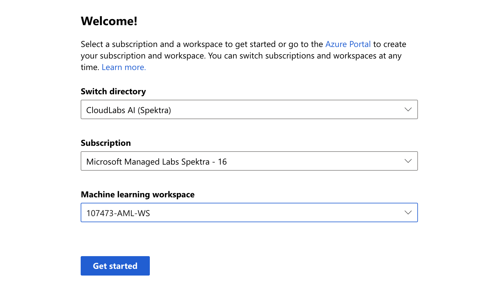

# Welcome to "Hands-on deep learning with TensorFlow 2.0 and Azure" Workshop!

<!-- 
Guidelines on README format: https://review.docs.microsoft.com/help/onboard/admin/samples/concepts/readme-template?branch=master

Guidance on onboarding samples to docs.microsoft.com/samples: https://review.docs.microsoft.com/help/onboard/admin/samples/process/onboarding?branch=master

Taxonomies for products and languages: https://review.docs.microsoft.com/new-hope/information-architecture/metadata/taxonomies?branch=master
-->

## Overview 
This repository contains content of a four part workshop of using Tensorflow 2.0 on Azure Machine Learning service. The different components of the workshop are as follows:

- Part 1: [Preparing Data and Model Training](https://github.com/microsoft/bert-stack-overflow/blob/master/1-Training/AzureServiceClassifier_Training.ipynb)
- Part 2: [Inferencing and Deploying a Model](https://github.com/microsoft/bert-stack-overflow/blob/master/2-Inferencing/AzureServiceClassifier_Inferencing.ipynb)
- Part 3: [Setting Up a Pipeline Using MLOps](https://github.com/microsoft/bert-stack-overflow/tree/master/3-ML-Ops)
- Part 4: [Explaining Your Model Predictions](https://github.com/microsoft/bert-stack-overflow/blob/master/4-Interpretibility/IBMEmployeeAttritionClassifier_Interpretability.ipynb)

The workshop demonstrates end-to-end Machine Learning workflow on the example of training a [BERT](https://arxiv.org/pdf/1810.04805.pdf) model to automatically tag questions on Stack Overflow.

## Getting started with the workshop environment

1. Provision your personal Lab environment

    * Open **Registration URL**: http://bit.ly/2OjknZW
    * Enter **Activation Code** which should be provided by the instructors of the workshop.
    * Fill out registration form and Submit it.
    * On the next screen click **Launch Lab**.
    * Wait until your personal environment is provisioned. It should take approximatly 3-5 minutes.

2. Login to Azure ML studio

    * Once the workshop enviroment is ready, you can open new browser tab and navigate to Azure ML studio, using it's direct URL: [https://ml.azure.com](https://ml.azure.com). We recommend to use Private Browser window for the login to avoid conflicting credentials if you already have Azure subscription.
    * Use credentials provided in the workshop environment to sign-in to Azure ML studio.
    * In the Welcome screen select preprovisioned subcription and workspace similar to screenshot below:
    
    * Click **Get started**!
    * In the welcome screen click on **Take a quick tour** button to familiarize yourself with Azure ML studio.

3. Create Azure Machine Learning Notebook VM

    * Click on **Compute** tab on the left navigation bar.
    * In the Notebook VM section, click **New**.
    * Enter Notebook VM name of your choice and click **Create**. Creation should take approximately 5 minutes.

4. Clone this repository to Notebook VM in your Azure ML workspace

    * Once Notebook VM is created and in Running state, click on the **Jupyter** link. This will open Jupyter web UI in new browser tab.
    * In Jupyter UI click **New > Terminal**.
    * In terminal window, type and execute command: `ls`
    * Notice the name of your user folder and use that name to execute next command: `cd <userfolder>`
    * Clone the repository of this workshop by executing following command: `git clone https://github.com/microsoft/bert-stack-overflow.git`

5. Open Part 1 of the workshop

    * Go back to the Jupyter window.
    * Navigate to `bert-stack-overflow/1-Training/` folder.
    * Open `AzureServiceClassifier_Training.ipynb` notebook.

You are ready to start your workshop! Have fun.
